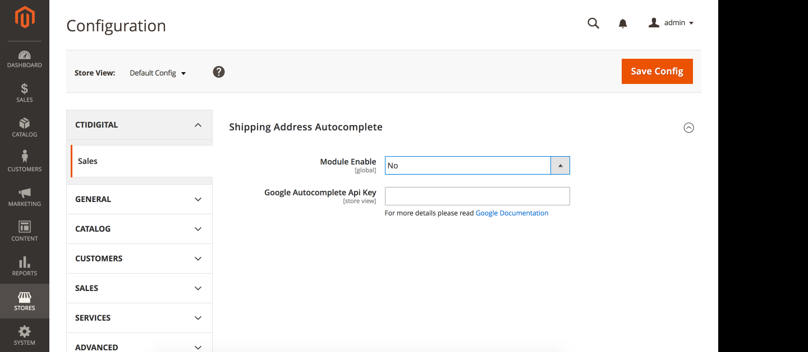
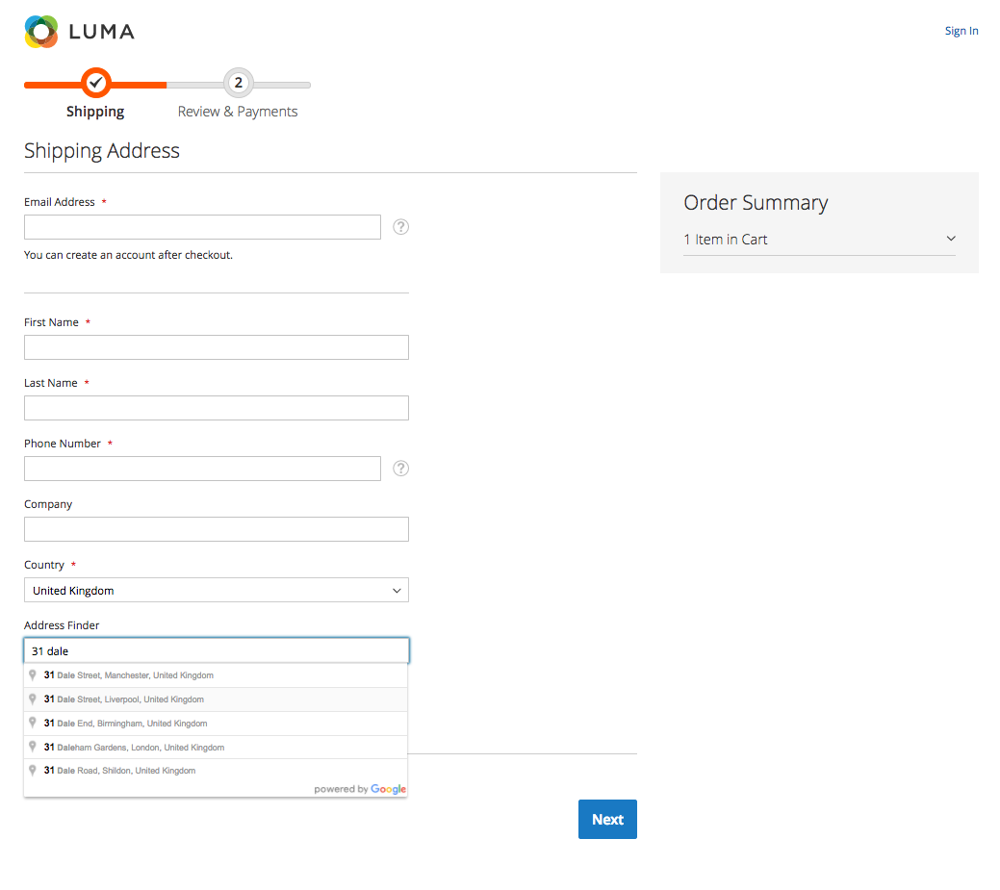
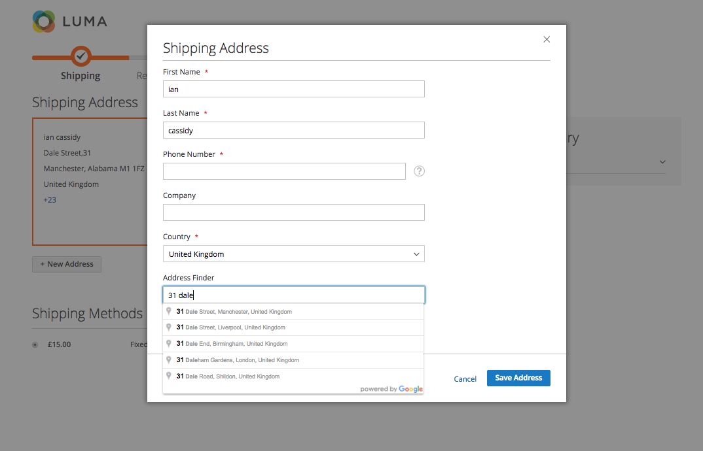
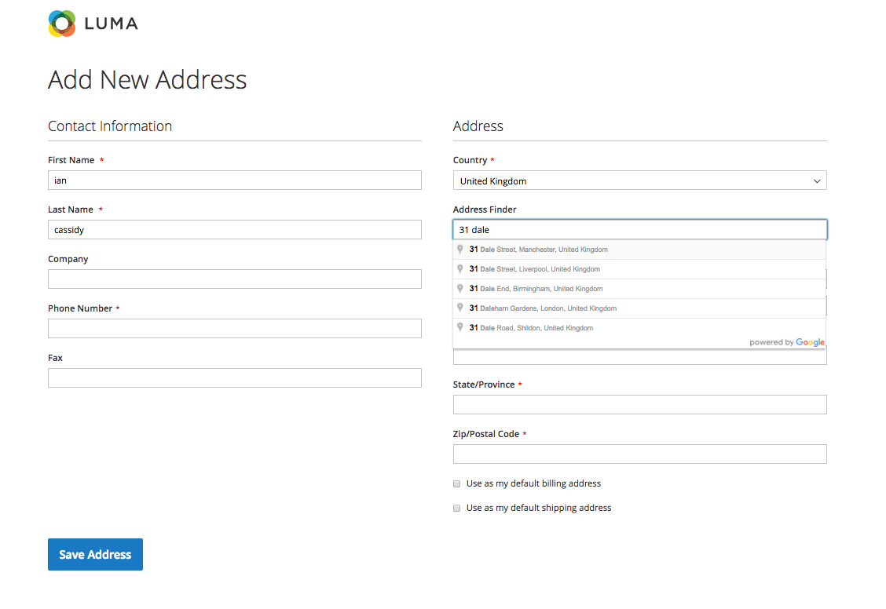

## Google Address Lookup for Magento 2
The Google Address Lookup module makes use of the Google Places API Web Service to provide the following functionality to your Magento 2 store.

1. Minimise address input errors by providing a post-code lookup service.
2. Reduce the number of visible input fields on the checkout by hiding city, state, street 1, street 2 and post-code fields.
3. Provide a manual address input override which will display the hidden fields.

**Note**: The Google Places API offers 150,000 FREE daily lookup requests for users that validate their account and add billing information. If you require more than 150,000 lookup requests daily then you can register to a paid plan. [See Usage Tiers & Pricing](https://developers.google.com/places/web-service/usage#verify_your_identity_by_enabling_billing)

## Configuration
After installing the module you will need to enable the module and generate a Key for the Google Places API Web Service in the [Google Console](https://console.developers.google.com) (see further reading).

##### Enabling the Module:
Store->Configuration->CtiDigital->Google Autocomplete

| Config Value  | Notes           |
| ------------- |-------------|
| Enable/Disable| if module is enabled then checkout configuration will be overridden and Google API is attached |
| API Key      | Enter your Google Places API Web Service key (see further reading) |

##### Address Lookup
Once enabled, the post-code lookup service will be used on:

* Guest Checkout
* Registered Customer Checkout (if they are adding a new address)
* My Account Address Management

## Further Reading
[Google Places API](https://developers.google.com/maps/documentation/javascript/places-autocomplete#address_forms)
[Google Places API Examples](https://developers.google.com/maps/documentation/javascript/examples/places-autocomplete-addressform)

## Implementation Details
* Configuration of checkout fields is in etc/frontend/di.xml This configuration is processed in CtiDigital/GoogleAddressLookup/Block/Checkout/LayoutProcessor.php
* Google Address fields are mapped in etc/frontend/di.xml and processed in CtiDigital/GoogleAddressLookup/Block/Js/GoogleApi.php. It will allow for easy third-party customizations like adding custom fields that should be also autocompleted.
* Javascript modules are written in es6 and compiled with gulp using babel. Src and dist files are in CtiDigital/GoogleAddressLookup/view

## Screenshots

